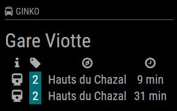
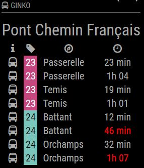

# MMM-Ginko
Public Transport of Besançon/France Module for MagicMirror<sup>2</sup>

## Example

 

## Dependencies
  * An installation of [MagicMirror<sup>2</sup>](https://github.com/MichMich/MagicMirror)
  * npm
  * [request](https://www.npmjs.com/package/request)

## Installation
 1. Clone this repo into `~/MagicMirror/modules` directory.
 2. Configure your `~/MagicMirror/config/config.js`:

    ```
    {
        module: "MMM-Ginko",
        position: "top_right",
        config: {
            stations: ["Gare Viotte","Pont Chemin Français","Pont Chemin Français","Pont Chemin Français","Pont Chemin Français"],
			lignes: ["102","23","24","23","24"],
			sens: ["0","0","0","1","1"]
        }
    }
    ```
 3. Run command `npm install` in `~/MagicMirror/modules/MMM-Ginko` directory.

## Config Options
| **Option** | **Default** | **Description** |
| --- | --- | --- |
| `stations` | REQUIRED | Insert here the stations names you want to display data from [How to find a name ?](https://www.ginkoopenapi.fr/DR/getArrets.do). |
| `lines` | REQUIRED | Insert here the lines ids you want to display data from [How to find a line ID ?](https://www.ginkoopenapi.fr/DR/getLignes.do). |
| `directions` | REQUIRED | Insert here lines direction (back = 0, forth = 1). |
| `max` | `5` | How many departures per route should be displayed. |
| `shortenStation` | `false` | After how many characters the station name should be cut. Default: show full name. |
| `shortenDestination` | `false` | After how many characters the destination name should be cut. Default: show full name. |
| `rotateInterval` | `20` (20 sec) | How fast should be switched between the stations in second. |
| `updateInterval` | `300` (5 mins) | How often should the data be fetched in second. |
| `showColored` | `true` | Should the display show lines colors ? |